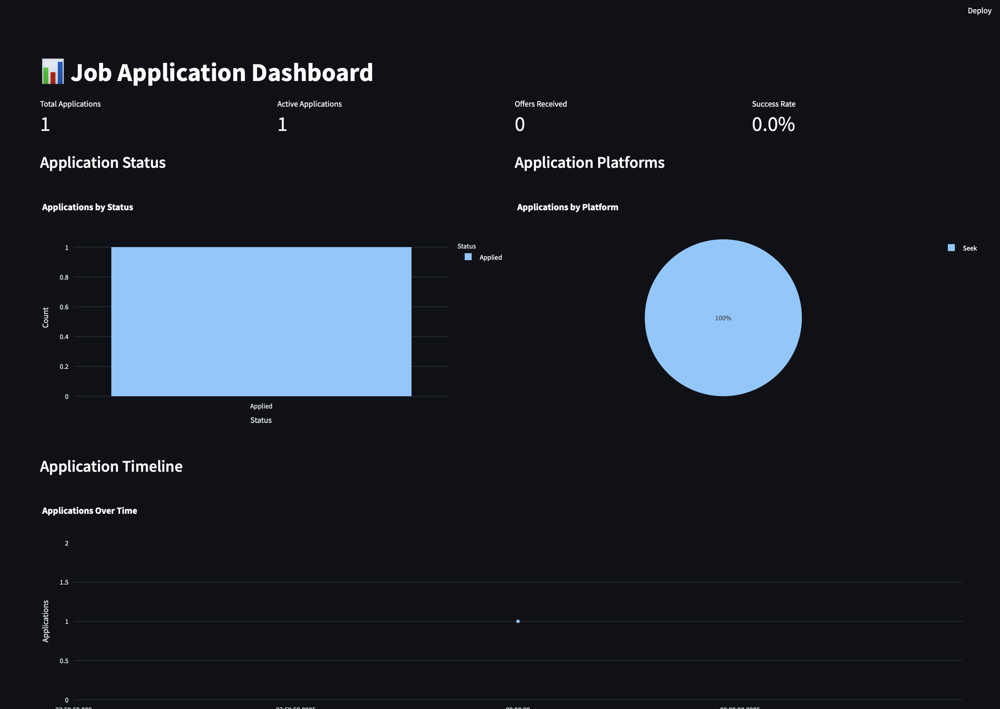
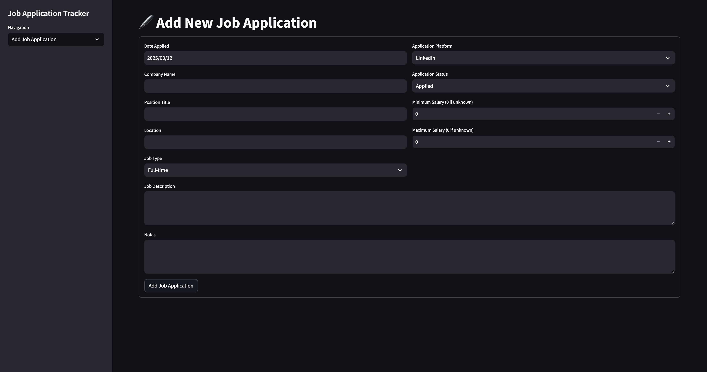
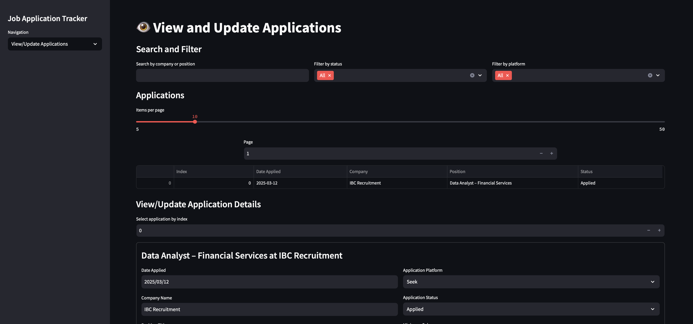
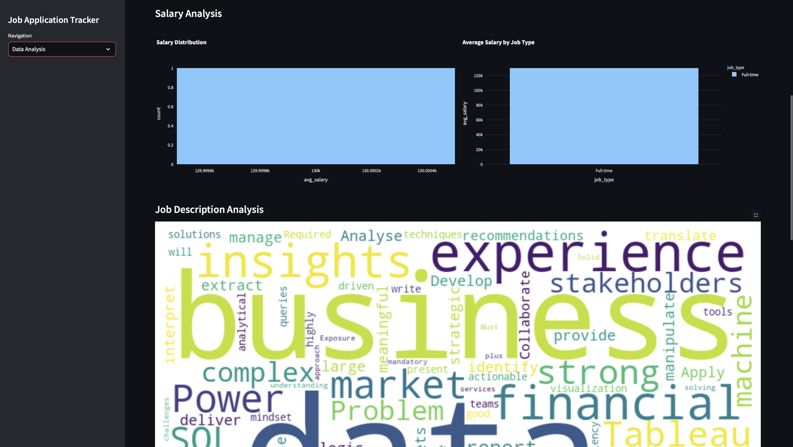

# Job-Tracker
A comprehensive Streamlit application for tracking and analyzing job applications.

## Features

- **Dashboard**: View key metrics and visualizations of your job application journey
- **Application Management**: Add, update, and delete job applications
- **Advanced Filtering**: Search and filter applications by company, status, and platform
- **Data Analysis**: Get insights into your job search with visualizations and statistics
- **Skills Analysis**: Extract common skills from job descriptions to identify trends
- **Timeline Tracking**: Monitor your application activity over time

## Screenshots






## Database Structure

The application stores job applications with the following fields:

- **date_applied**: Date when you applied for the job
- **company_name**: Name of the company
- **position_title**: Job position title
- **salary_min**: Minimum salary (if available)
- **salary_max**: Maximum salary (if available)
- **platform**: Platform used to apply (LinkedIn, Indeed, etc.)
- **job_description**: Full job description
- **status**: Current application status (Applied, Interview, Offer, etc.)
- **location**: Job location
- **job_type**: Type of job (Full-time, Part-time, Contract, etc.)
- **last_updated**: Date when the application was last updated
- **notes**: Additional notes about the application

## Installation

1. Clone this repository:
   ```
   git clone https://github.com/hemangsharma/job-tracker.git
   cd job-tracker
   ```

2. Create a virtual environment:
   ```
   python -m venv venv
   source venv/bin/activate  # On Windows: venv\Scripts\activate
   ```

3. Install required packages:
   ```
   pip install -r requirements.txt
   ```

4. Run the application:
   ```
   streamlit run app.py
   ```

## Usage

### Adding a Job Application

1. Navigate to the "Add Job Application" page
2. Fill in the job details
3. Click "Add Job Application"

### Updating Application Status

1. Go to "View/Update Applications"
2. Select the application to update using its index
3. Update the status and any other details
4. Click "Update Application"

### Analyzing Your Job Search

1. Visit the "Data Analysis" page
2. Review metrics like response rate, interview rate, and offer rate
3. Analyze salary distributions and common skills
4. Track your application timeline

## Customization

### Adding Custom Application Statuses

Open `app.py` and modify the `APPLICATION_STATUSES` list.

### Adding Custom Job Platforms

Open `app.py` and modify the `JOB_PLATFORMS` list.

## Contributing

Contributions are welcome! Please feel free to submit a Pull Request.

## License

This project is licensed under the MIT License - see the LICENSE file for details.
